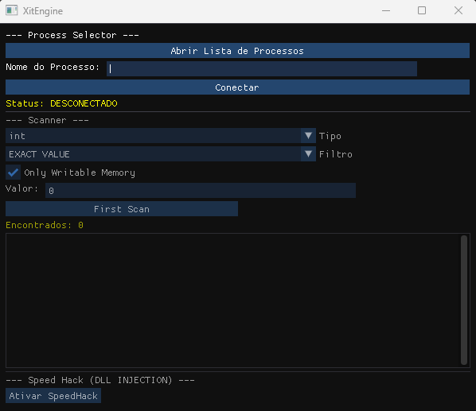

## Preview

Solução alternativa lightweight do Cheat Engine, em breve disponibilizarei uma build beta.

## Dependencias

ao modificar as dependencias, rode:

- vcpkg install --triplet=x64-mingw-static

ao modificar o CMakeLists.txt, exclua a pasta "out".

## TO DO

- o programa atual só está funcionando para procurar variaveis com exact value, incremente os filtros.
Também precisamos usar um EPSILON quando for buscar por variaveis com casas decimais (float e double), pois oque esta sendo exibido na tela pode ser uma aproximação. (se bem que essa comparação deve ser cara computacionalmente)

- adicionar uma barra de progresso do scanner

- adicionar lista de savedAdresses na interface

- adicionar janela de modificação de endereço com opções para alterar valor, description, deletar, manter valor locked

- Também adicione essas opções de tipo de variavel: 2 bytes, 4 bytes, 8 bytes, All

- tornar speed hack funcional

- função unrandomizer